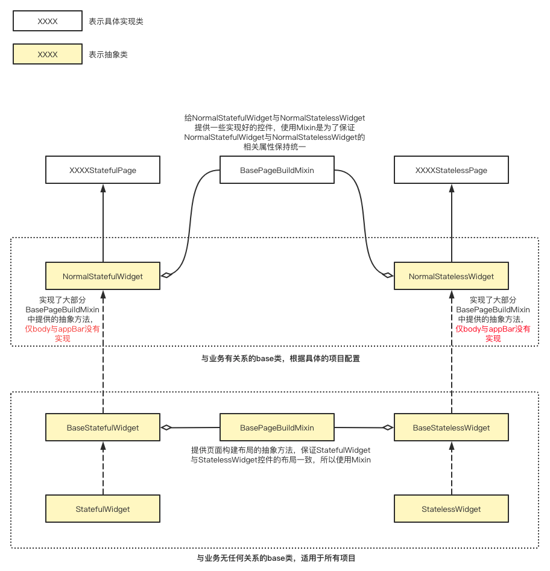

# 组件库

### project_base_libs_pkg

在```pubspec.yaml```的```dependencies:```中引入：
```
  project_base_libs_pkg:
    git:
      url: https://github.com/YouXianMing/flutter_project_pkg.git
      path: project_base_libs_pkg
```

该基础组件库不依赖于任何项目的业务，自带了example，可以单独运行。你也可以在[flutter_projects](https://github.com/YouXianMing/flutter_projects)中查看具体的使用情形。以下是该组件库中一些重要的类：

名字|描述
:-|:-
DioNetwork|对dio的初级封装
AnimationsManager|简化动画使用的管理器
SliverSection|将Sliver家族的控件封装到了SliverSection对象，简化Sliver家族控件的使用并添加了瀑布流、SectionHeader悬停的支持
app_print|打印信息将包含完整的文件路径，点击后可以直达app_print所在的行
InformationView|实现了各种Toast、AlertView、SheetView的基础控件，可高度定制各种效果，可以在页面里或者overlay中显示，与实现了MaybePopMixin的类配合可以在overlay中处理maybePop事件（安卓物理返回键事件）。
AnimatedRotate|子控件按照顺时针或者逆时针旋转，可暂停
BaseAppBar|（抽象）对AppBar的封装
BasePageBuildMixin|（抽象）基础页面的架构
BaseStatelessWidget|（抽象）基础的StatelessWidget，与BasePageBuildMixin进行mixin，提供基础的页面架构
BaseStatefulWidget|（抽象）基础的StatefulWidget，与BasePageBuildMixin进行mixin，提供基础的页面架构
CustomTabBarWidget|简化TabBar的使用
CustomWrapWidget|通过FlowDelegate实现的Wrap组件，高度无限，可以限定Wrap的行数
FirstTimeLoadingWidget|首次加载的loading的Widget，是一个接收Future对象或者Future数组的Widget，加载成功该Widget会消失，加载失败会进入失败重试的Widget，可以定制请求的界面以及失败重试界面
IndicatorWidget|这是一个Indicator的容器类,使用了外观设计模式,隐藏各个不同的indicator的细节,提供统一的使用接口
SpinKitIndicatorConfig|对第三方库[flutter_spinkit](https://pub.dev/packages/flutter_spinkit)进行的封装，用于IndicatorWidget
CytrynIndicatorConfig|对第三方库[loading_animations](https://pub.flutter-io.cn/packages/loading_animations)进行的封装，用于IndicatorWidget
TinoGuoIndicatorConfig|对第三方库[loading_indicator](https://pub.dev/packages/loading_indicator)进行的封装，用于IndicatorWidget
WateryDesertIndicatorConfig|对第三方库[loading_animation_widget](https://pub.dev/packages/loading_animation_widget)进行的封装，用于IndicatorWidget
SafeAreaPaddingWidget|添加安全距离的Widget
SliversRefreshWidget|对[pull_to_refresh](https://pub.flutter-io.cn/packages/pull_to_refresh)进行封装，简化其使用
StackContainer|一个Stack的管理器
BaseButtonWidget|一个包含了普通、高亮、禁用状态的Button控件，可用于封装Button用
AnimatedButtonWidget|基于BaseButtonWidget封装的支持交互动画的Button
OpacityButtonWidget|基于BaseButtonWidget封装的支持透明度动画的Button
ToastWidget|一个Toast控件
ScanFilesTool|一个用于递归扫描文件夹用的工具类，支持设定扫描深度
SpVal|通过枚举值的方式设置SharedPreferences，不需要手动设置key
BaseButtonWidget|一个包含了普通、高亮、禁用状态的Button控件，可用于封装Button用

### BaseStatelessWidget、BaseStatefulWidget与BasePageBuildMixin


